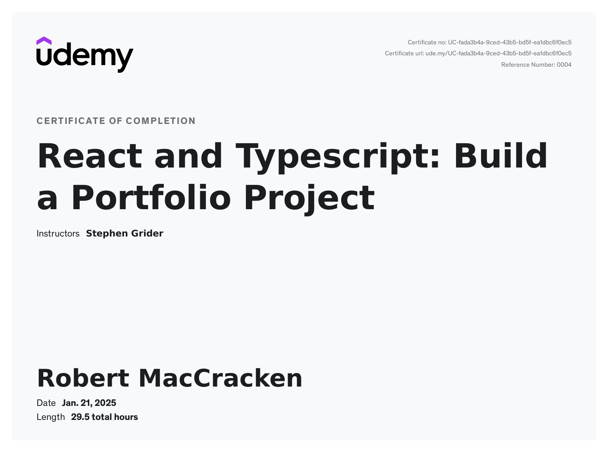

# Typescript Basics

[Overview](https://www.udemy.com/course/react-and-typescript-build-a-portfolio-project/learn/lecture/24339926#overview)

This folder follows learning for the above udemy class.

Course Goals

* Syntax + Features
  * Understanding basic types in TS
  * Function type + annotations
  * Type definition files
  * Arrays in TS
  * Modules systems
  * Classes + Refresher on OOP
* Design Patterns
  * Projects

